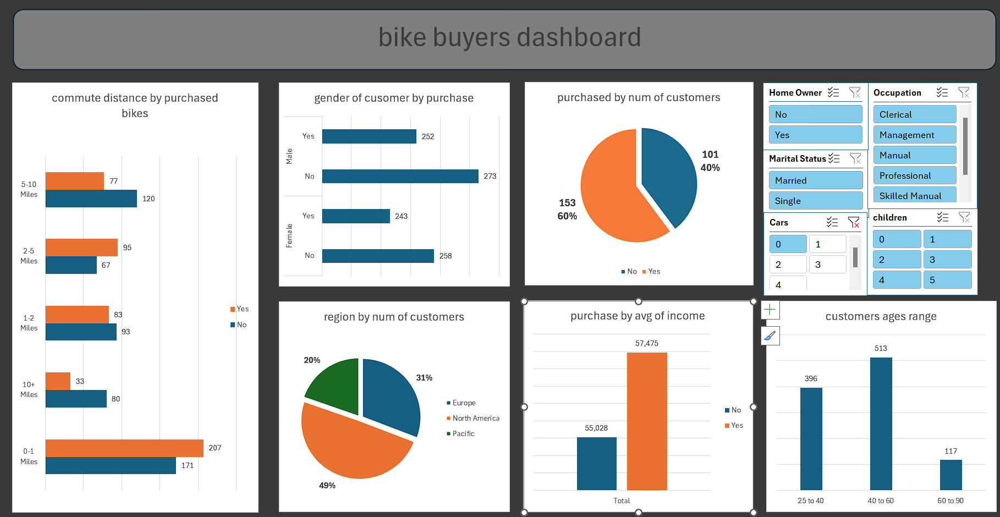

# Bike-Buyers-Analysis-Dashboard
# 🚴 Bike Buyers Analysis Dashboard

An interactive Excel dashboard analyzing **bike buyers' dataset** to uncover key insights about customer demographics, purchasing behavior, and factors influencing bike purchases.

---

## 🎯 Project Objectives
- Understand the relationship between **customer demographics** and bike purchases  
- Identify patterns based on **age, gender, income, marital status, and region**  
- Compare **average income** of bike buyers vs non-buyers  
- Analyze bike purchase behavior by **occupation, number of children, and cars owned**  
- Provide clear visuals to support **data-driven marketing decisions**  

---

## 📊 KPIs & Metrics
- **Total Customers**
- **Number of Bike Buyers**
- **Number of Non-Buyers**
- **Average Income of Buyers vs Non-Buyers**
- **Bike Purchase Rate (% of customers who own a bike)**

---

## 📊 Dashboard Insights & Charts
The dashboard answers key business questions such as:

- **Commute Distance vs Bike Purchase** → Understand how travel distance affects the likelihood of purchasing a bike  
- **Gender vs Bike Purchase** → Compare male vs female customers' buying behavior  
- **Region by Number of Customers** → Identify which regions have the most potential buyers  
- **Purchase Rate by Number of Customers** → See overall purchase conversion rate  
- **Purchase Decision by Average Income** → Explore how income impacts bike purchase decisions  
- **Customers Age Range** → Group customers into age segments to see which group buys the most bikes  

---

## 🎛 Interactivity
The dashboard contains **five slicers** to allow dynamic exploration of data:
1. **Home Ownership** (Owns Home / Rents)  
2. **Marital Status** (Married / Single)  
3. **Number of Cars Owned**  
4. **Occupation**  
5. **Number of Children**  

> These slicers make it easy to filter and compare purchase behavior across different demographic groups.

---

## 🧠 Skills Demonstrated
- Data Cleaning & Preparation (Age grouping, categorical encoding)
- Excel **PivotTables & PivotCharts**
- Advanced use of **Slicers & Timelines**
- Customer segmentation & behavioral analysis
- Data storytelling & visualization

---

## 🖼️ Dashboard Preview

---

## 💡 Notes
This dashboard helps reveal **which demographic and lifestyle factors influence bike purchases**, giving businesses data-driven insights to design better marketing strategies.
